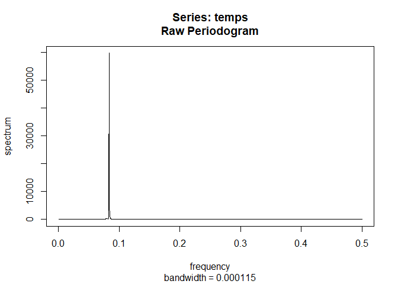

Climate Change
================
Chicago Snow
12/14/2020

# Introduction

Here we consider historical data of Global Average Land Temperatures to
evaluate global warming. Data came from
<https://www.kaggle.com/berkeleyearth/climate-change-earth-surface-temperature-data>,
which took raw data from Berkely Earth data page.

We first read in our data

``` r
country_time <- read.csv("GlobalLandTemperaturesByCountry.csv")
```

Now, we look for the list of unique countries which we have data for.

``` r
head(unique(country_time$Country))
```

    ## [1] "Ã…land"         "Afghanistan"    "Africa"         "Albania"       
    ## [5] "Algeria"        "American Samoa"

For our initial analysis, we look at the data for the United States. We
plot out our data as a time series.

``` r
usa_data <- country_time[country_time$Country == "United States",]

# Note that there are many rows (initially) with 'NA' values - we remove these rows,
# as we lack any data

usa_temp <- na.omit(usa_data)

# We keep in mind that the data is taken using month as our time interval.
temps <- ts(usa_temp$AverageTemperature)
ts.plot(temps)
```

<!-- -->

This is a bit unreadable, and though it looks like white noise, we
recall that the data is for average monthly temperatures, indicating
seasonal cycles. We tackle this with Spectral Analysis.

``` r
# Spectral Analysis
periodogram <- spec.pgram(temps,taper=0,log="no")
```

<!-- -->

From the periodogram, it is clear that the period made evident by this
data is the annual change in seasons. So we must tackle this in a
different way.

``` r
years <- strtoi(unique(substr(usa_temp$dt, 1, 4)))
usable <- years[23:215]

annual_data <- c()
for (a in usable) {
  comp <- toString(a)
  this_year <- usa_temp[substr(usa_temp$dt,1,4) == comp,]
  annual_data <- c(annual_data, mean(this_year$AverageTemperature))
}

annual_data <- ts(annual_data)

# We know have average temperature over 207 years

ts.plot(annual_data)
```

<!-- -->

``` r
# Kernel Smoothing
ts.plot(annual_data, main = "Kernel Smoothing for Average Yearly Temperature")
lines(ksmooth(time(annual_data), annual_data, "normal", bandwidth=10), lwd=2, col="Blue")
lines(ksmooth(time(annual_data), annual_data, "normal", bandwidth=50), lwd=2, col="Green")
```

<!-- -->

We see some very interesting results from this, including our Kernel
Smoothing method. It seems that our average yearly temperatures have
been on a gradually increasing trend, as evidenced by both the 10 and 50
year weighted moving averages (Kernel Smoothing). It may be better to
analyze each season independently, but let us first conduct spectral
analysis.

``` r
# Spectral Analysis
periodogram <- spec.pgram(annual_data,taper=0,log="no")
```

<!-- -->

``` r
spikes <- data.frame("Freq" = periodogram$freq, "Spec" = periodogram$spec)
spikes[spikes$Spec >= .75,]
```

    ##     Freq      Spec
    ## 1  0.005 1.2453314
    ## 2  0.010 1.3185455
    ## 3  0.015 1.5684803
    ## 30 0.150 0.8929835
    ## 50 0.250 1.2384786

We see that the spikes of magnitude 1.567, 1.318, and 1.238 are the ones
of significance. These correspond to periods of 66.67 years, 100 years,
and 4 years, respectively. Confidence Intervals

``` r
sort_peaks <- sort(periodogram$spec, decreasing = TRUE)[c(1,2,4)] # get top 2
U = qchisq(0.025,2)
L = qchisq(0.975,2)
# Peak 1
c((2*sort_peaks[1])/L, (2*sort_peaks[1])/U)
```

    ## [1]  0.4251915 61.9516617

``` r
# Peak 2
c((2*sort_peaks[2])/L, (2*sort_peaks[2])/U)
```

    ## [1]  0.357438 52.079766

``` r
# Peak 3
c((2*sort_peaks[3])/L, (2*sort_peaks[3])/U)
```

    ## [1]  0.335733 48.917293

Above are the confidence intervals.

We can also consider seasonal data; however, after data cleaning, the
code and process is very much the same.
